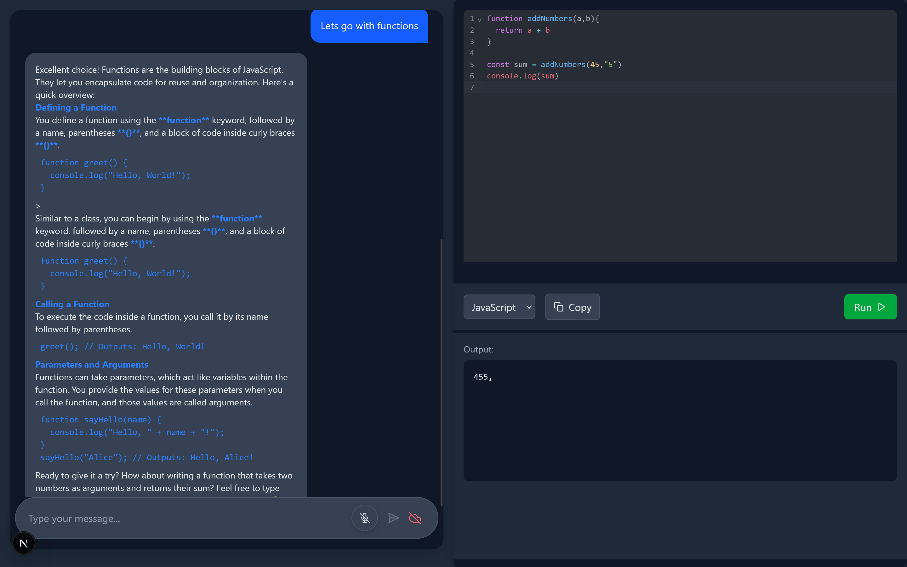

# DevTutor - Your AI-Powered Coding Companion

DevTutor is an intelligent coding education platform that combines real-time AI chat with an integrated code editor to provide an immersive learning experience.

## Features

### 1. About Page

The landing page introduces DevTutor's core features and capabilities. It showcases:
- Real-time AI Chat functionality
- Integrated Code Editor
- GPT-powered assistance
- Modern, dark-themed UI for comfortable coding sessions

### 2. Introduction

The introduction section provides users with:
- Seamless onboarding experience
- Clear explanation of DevTutor's capabilities
- Quick access to start learning
- Overview of the platform's features

### 3. Working Demo

The working interface demonstrates:
- Real-time AI chat interaction
- Code editor with syntax highlighting
- Multiple programming language support
- Instant code execution capabilities
- Live AI responses and code suggestions

## Key Features

- **Real-time AI Chat**: Get instant responses and explanations from our AI tutor
- **Integrated Code Editor**: Write and run code directly in the browser
- **Multi-language Support**: Supports JavaScript, Python, C++, and Java
- **GPT Integration**: Powered by the latest GPT technology for intelligent assistance
- **Dark Theme**: Easy on the eyes for long coding sessions
- **Instant Execution**: Run code and see results immediately

## Technical Stack

- Next.js for the frontend framework
- Tailwind CSS for styling
- CodeMirror for the code editor
- GPT API for AI interactions
- Real-time WebSocket communication

## Getting Started

